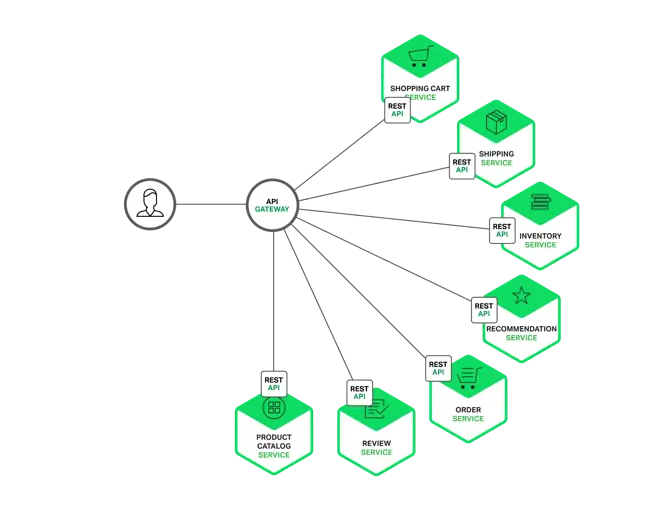
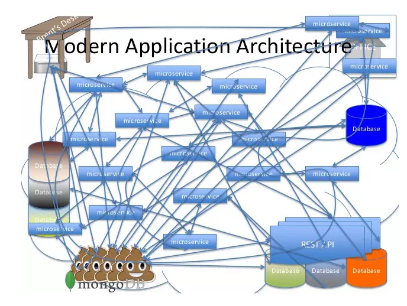

# GateWay Pattern là gì ? 
### GateWay là một cổng trung gian , GateWay nhận request và điều hướng Request tới các service trong hệ thống 
## Hình ảnh minh họa nếu sử dụng GateWay 

## Hình ảnh minh họa nếu không sử dụng GateWay

## Nhiệm vụ chính của GateWay : 
	- Routing : Quản lý các dịch vụ và phân phối request từ client đến dịch vụ tương ứng.
	- Offloading : Cung cấp khả năng giảm tải thôngqua cung cấp các cross-cutting function sử dung chung bởi các microservices.
## Lợi ích của GateWay :
	- Che dấu được đi cấu trúc của hệ thống micro Service
	- Bên ngoài chỉ cần chọc vào GateWay  
## Service Discovery : 
 ### 1.Consul
	- Consul là gì ?  consul là kho dữ liệu , sử dụng gossip để quản lý tư cách thành viên và hình thành các cụm động  và giao thức bè để cung cấp tính nhất quán 
	- Consul làm gì : Consul hỗ trợ kiểm tra tình trạng , chẳng hạn như máy chủ còn hoạt động ko ? sử dụng bộ nhớ trên 90 % 
 ### 2.Ribbon là gì ? 
 	- Ribbon là bộ cân bằng tải phía máy khách để luân chuyển các yêu cầu giữa 1 danh sách các máy chủ logic như rouncd robin hoặc dựa trên độ phức tạp . hiện tại trong ocelot có option Load Balancing .vậy load balancing là gì ?
 	load balancing phân phối các tài nguyên chia đều giữa các lần request 
 	ví dụ : lần thứ nhất Gateway sẽ call đến Service A , lần 2 sẽ call đến Service B trên cùng 1 route

